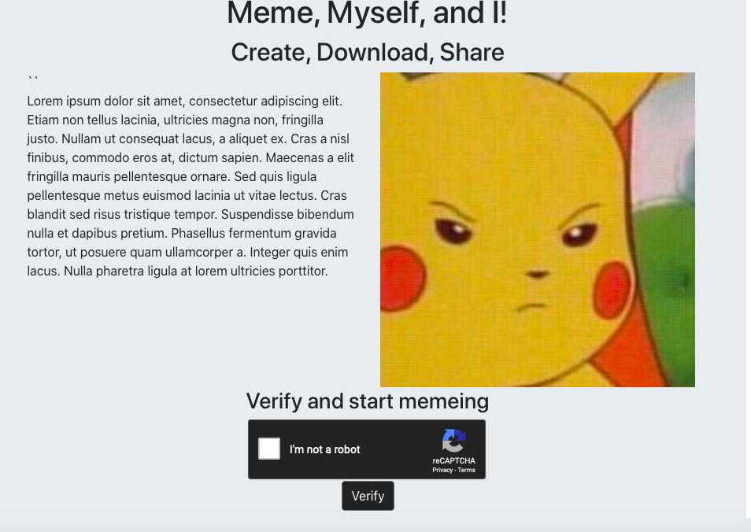
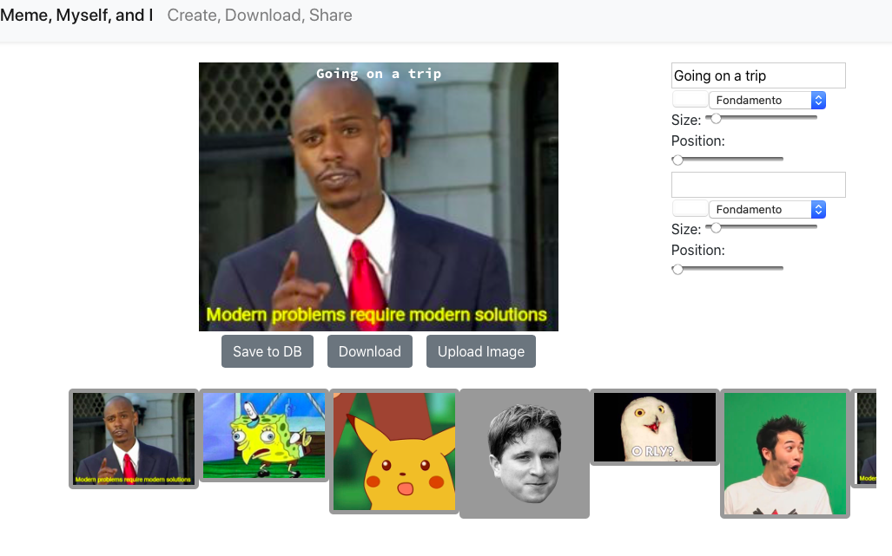

# Meme Myself, and I

## Description
            
An app that lets users overlay text onto images, renders said output to be downloaded to user’s device or save new templates to the local database for future use.

## User Story
```
As a USER  
I WANT to create my own custom images from my own photos  
SO THAT I can share them with my friends and family

```

## Welcome page:



## Meme page:



## Deployed app: 

[Meme, Myself, and I](https://powerful-taiga-38043.herokuapp.com/ "Meme, Myself, and I")

            
## Table of Contents
            
* [Installation](#Installation)
* [Usage](#Usage) 
* [Contributing](#Contributing) 
* [License](#License) 
* [Technologies](#Technologies)
            
        
## Installation
            
**Step 1 - Clone my repo using the command line below.**
```
git clone https://github.com/Linkm1993/Project-3.git
```
**Step 2 - Change directory to the cloned repo folder.**
```
cd Project-3
```
**Step 3 - Install all required NPM packages.**
```
npm install 
```
**Step 4 - Start the application server using the command line below**
```
npm start

```
            
## Usage
            
npm start

## Technologies Implemented

* Bootstrap
* React
* HTML Canvas
* Captcha
* Mongo & Mongoose
* HTML2Canvas
* Node
* Express
* Heroku


## Breakdown of Roles by Member

* **Nate** - Database Seeds and setup, Upload from Machine & Gallery 
* **Regina** - Research (Twitter, Ant Design), Authentication, CSS, **Professional Googler**  
* **Kenneth** - Canvas, HTML2Canvas, Text and Image CSS Manipulation  
* **Matt** -  Recaptcha, Deployment, Research (Imgur & Twitter), Post Route  
* **Alex** - Wireframes, Models, Get Route, Local Storage, Bootstrap, Gallery


## Future Updates
* Custom filters for image processing


* Deleting images from database


* Fully implementing authentication & connecting created images to users


* “Undo” button - reloading an image back into gallery, adjusting text and image processing


* Nicer front end, including animations and mobile responsiveness


* Sharing images to social media
           
            
## Contributing
            


[](https://www.github.com/kdeguzm3) | 
[](mailto:cosplaydiver@gmail.com)


[](https://www.github.com/Antidetka) | 
[](mailto:musovirova@yahoo.com)


[](https://www.github.com/altays) | 
[](mailto:altays633@gmail.com)


[](https://www.github.com/nrlong) | 
[](mailto:nrlong13@gmail.com)
 
 
## License
            
MIT
          
            
## Questions
            
[](https://www.github.com/Linkm1993) | 
[](mailto:Linkm1993@gmail.com)
